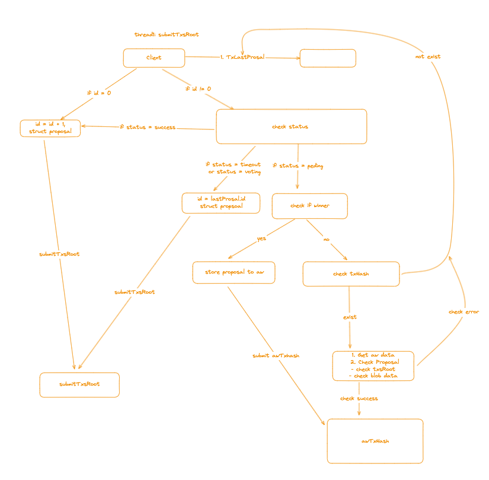
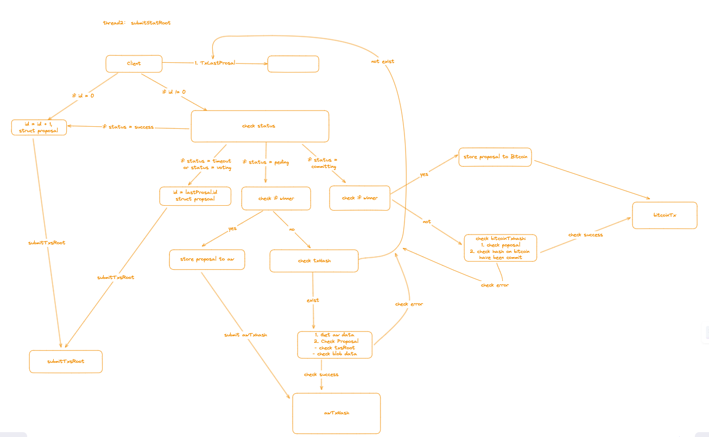

# b2-committer

# Introduce

Submit op txs to decentralized store(e.g arweave)


Submit op l2 state roots to decentralized store(e.g arweave)


## environment Variables

| env                                | value                                                        | description                              | remarks                   |
| ---------------------------------- | ------------------------------------------------------------ | ---------------------------------------- | ------------------------- |
| LOG_LEVEL                          | info                                                         |                                          | warn、error、panic、fatal |
| LOG_FORMAT                         | text                                                         |                                          | options: text、json       |
| MYSQL_DATA_SOURCE                  | root:root@tcp(127.0.0.1:3306)/b2_committer?charset=utf8mb4&parseTime=True&loc=Local&multiStatements=true |                                          |                           |
| MYSQL_MAX_IDLE_CONNS               | 10                                                           |                                          |                           |
| MYSQL_MAX_OPEN_CONNS               | 20                                                           |                                          |                           |
| MYSQL_CONN_MAX_LIFETIME            | 3600                                                         |                                          |                           |
| RPC_URL                            | https://b2-nodes.bsquared.network                            | B2NODE-RPC                               |                           |
| BEACON_CHAIN_ID                    | 11155111                                                     |                                          |                           |
| BEACON_CHAIN_RPC_URL               | 3600                                                         |                                          |                           |
| BLOCKCHAIN                         | B2-NODE                                                      |                                          |                           |
| INIT_BLOCK_NUMBER                  | 0                                                            | for begainning to sync block to local db |                           |
| INIT_BLOCK_HASH                    | 0x9612534dc810c9c51211c77def2db781d7cc7979b0cb076a47c9fc6fb6dc475c | Init block hash                          |                           |
| INIT_BLOB_BLOCK_NUMBER             | 5687501                                                      |                                          |                           |
| INIT_BLOB_BLOCK_HASH               | 0x6218666b40fce4153e8f5349ab2f9d2590a601e5a178e4b6d4580094d5c0c2ee |                                          |                           |
| BLOB_INTERVAL_TIME                 | 3600                                                         | btc-network type                         |                           |
| OUTPUT_INTERVAL_TIME               | 3600                                                         | btc-network type                         |                           |
| L2_OUTPUT_ORACLE_PROXY_CONTRACT    | 0x90E9c4f8a994a250F6aEfd61CAFb4F2e895D458F                   | btc-network type                         |                           |
| BATCHER_INBOX                      | 0xff00000000000000000000000000000011155420 (op batcher inbox) | btc-network type                         |                           |
| BATCHER_SENDER                     | 0x8F23BB38F531600e5d8FDDaAEC41F13FaB46E98c (op batcher inbox) | btc-network type                         |                           |
| DSTYPE                             | arweave (DecentralizedStore type)                            | btc-network type                         |                           |
| B2NODE_ARWEAVE_WALLET              | /tmp/wallet/account.json                                     | btc-network type                         |                           |
| B2NODE_ARWEAVE_RPC                 | https://arweave.net                                          | btc-network type                         |                           |
| UNISAT_URL                         | https://open-api-testnet.unisat.io/                          | privateKey                               |                           |
| UNISAT_PRIVATE_KEY                 |                                                              | btc commit destination                   |                           |
| B2NODE_CHAIN_ID                    | 11155111                                                     | btc commit destination                   |                           |
| B2NODE_RPC_URL                     | 11155111                                                     | btc commit destination                   |                           |
| B2NODE_OP_COMMITTER_ADDRESS        | 0x270794Fc3ca753CDE033D2AeF9D00EAf71EbC386                   | btc commit destination                   |                           |
| B2NODE_OP_PROPOSERS_ADDRESS        | 0x837596C1Aa783E3B06C7Efb10a51Fe6699208D1D                   | btc commit destination                   |                           |
| B2NODE_OP_PROPOSAL_MANAGER_ADDRESS | 0x837596C1Aa783E3B06C7Efb10a51Fe6699208D1D                   | btc commit destination                   |                           |
| B2NODE_CREATOR_ADDRESS             | 0xb634434CA448c39b05b460dEC51f458EaC1e2759                   | btc commit destination                   |                           |
| B2NODE_CREATOR_PRIVATE_KEY         | 0a81baab0ca0b65d406d68c79945054b092cbe77499ca55c57b3ecfd33f1d551 | btc commit destination                   |                           |
| BITCOIN_NETWORK_NAME               | testnet3                                                     | btc commit destination                   |                           |
| BITCOIN_PRIVATE_KEY                |                                                              | btc commit destination                   |                           |
| COMMITTER_DESTINATION_ADDRESS      | tb1q6t5py7fqml8patll2jzfc26q7987xqthslyvj4                   | btc commit destination                   |                           |

Reference environment params

`B2NODE_CHAIN_ID=11155111;B2NODE_OP_COMMITTER_ADDRESS=0xE3DA42426AdEABC1c8d1ac28e79ef0bccbb6311e;B2NODE_OP_PROPOSAL_MANAGER_ADDRESS=0x16Bb9b79187B8d6C6Ad3ADe6dfA650070AA831c7;B2NODE_OP_PROPOSERS_ADDRESS=0x53bf2212Df41130F68Dfdf3f985105534C37e3E2;B2NODE_RPC_URL=https://quaint-white-season.ethereum-sepolia.quiknode.pro/b5c30cbb548d8743f08dd175fe50e3e923259d30;BATCHER_INBOX=0xfF000000000000000000000000000000000000FF;BATCHER_SENDER=0x4D0ca19b3c317DdB3c67FCC2C033ff0c25787BEe;BEACON_CHAIN_ID=213;BEACON_CHAIN_RPC_URL=https://hub-cl-rpc.bsquared.network;INIT_BLOB_BLOCK_HASH=0x35db0d9c50e33120690f50d2a50001be60c8c6b6871e03c2b8a1d39235b52d2d;INIT_BLOB_BLOCK_NUMBER=124543;INIT_BLOCK_HASH=0x0ade6a25acf1c5fa0f2b683584a2ea12a4913751b306549f5a740a39e2e38ec1;INIT_BLOCK_NUMBER=0;L2_OUTPUT_ORACLE_PROXY_CONTRACT=0x7893392346c2D73730733002718F278b4301dF83;RPC_URL=https://hub-rpc.bsquared.network`

### Run

```
go run main.go
```
