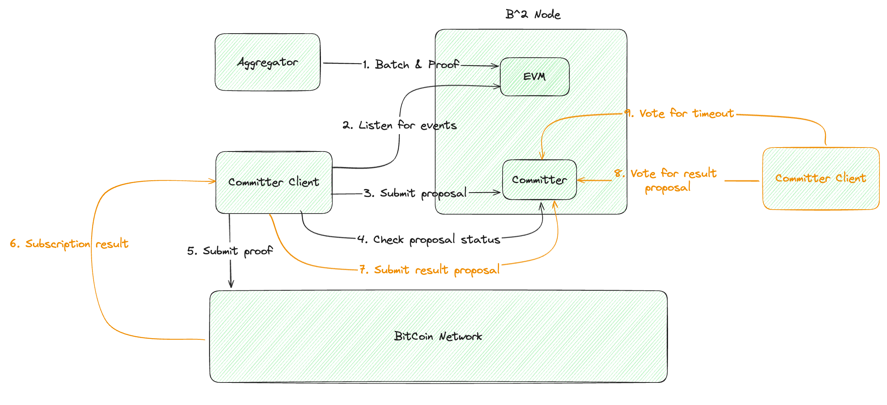

# b2-committer

## Introduction


## Details 
https://github.com/b2network/b2-node/issues/93

## Description

Step1：Rollup Aggregator invoke method verifyBatchesTrustedAggregator in PolygonZkEVM.sol  
Step2: b2-committer listen for events (verifyBatchesTrustedAggregator) and store data in Mysql  
Step3: b2-committer submit proposal to b2-node (send a transaction)  
```
transaction {  
     "proposalId":  getLastProposalId() from b2-node api,
     "stateRoot": rootHash from a merkle tree which contains all the stateRoots of the batch, which are range of startBatchNum and endBatchNum,
     "rootHash" from a merkle tree which contains all the proofs of the batch, which are range of startBatchNum and endBatchNum,
     "startBatchNum": getFinalBatch() from b2-node rpc or rest interface,
     "endBatchNum": startBatchNum + 10 (defined a constant)
```

Generate a proposal in b2-node depends on this transaction. 
```
proposal {  
    "transaction": transaction from above describe,
    "currentBlockNum": the current b2-node block number,
    "voteMax": how many b2-committer node need to vote,
    "txVoteNum": voteNums Step3,
    "resultVoteNum": voteNums Step8,
    "winAddress": which address has the entitlement to execute submitter to submit data(stateRoot and proof) to btc network
    "btcTxId": btc tx id which contains the stateRoot and proof  
    "voteAdressList": already vote address list,
    "state": (PENDING, SUCCESS, TIMEOUT),
}
```
simple algorithm about winAddressIndex
```
 winAddressIndex = tx_id% voteAdressList
 winAddress = voteAdressList[winAddressIndex]
```
you can get winAddress using api of b2-node.

after generated a proposal, put proposalId to channel[proposalId]

Step4: get proposalId from channel[proposalId]] and search proposal state from b2-node api.
if state is PENDING, and check winAddress equal local b2-committer address, then execute submitter to submit data(stateRoot and proof) to btc network  
Step5: get the btcTxId from Step4, and put it in channel[btcTxId], and then update finalBatchNum in b2-node  
Step6: go service loop channel[btcTxId] and get the btcTxId, and query the blockNum of btc network by btcTxId. If blockNum is confirmed, then execute Step7.  
Step7: the b2-committer which execute btc transaction and get the btcTxId update the proposal btcTxId.  
Step8: every b2-committer node loop their channel[proposalId] to check btcTxId is null or not. If not, then check the btcTxId blockHeight and submit a transaction to b2-node to vote.
resultVoteNum++. if resultVoteNum > 50%, then update state to SUCCESS.  
Step9: loop check proposal by proposalId from channel[proposalId]. if the state of proposal is still PENDING and (currentBlockNum - proposal.currentBlockNum)> 10000, than update state to TIMEOUT and go to Step 3 again.


## environment Variables

| env        | value                                                                                                    | description            | remarks            |
|------------|----------------------------------------------------------------------------------------------------------|------------------------|--------------------|
| LOG_LEVEL  | info                                                                                                     |                        | warn、error、panic、fatal  |
| LOG_FORMAT | text                                                                                                     |                        | options: text、json |
| MYSQL_DATA_SOURCE | root:root@tcp(127.0.0.1:3306)/b2_committer?charset=utf8mb4&parseTime=True&loc=Local&multiStatements=true |                        |                    |
| MYSQL_MAX_IDLE_CONNS | 10                                                                                                       |                        |                    |
| MYSQL_MAX_OPEN_CONNS | 20                                                                                                       |                        |                    |
| MYSQL_CONN_MAX_LIFETIME | 3600                                                                                                     |                        |                    |
| RPC_URL | https://b2-nodes.bsquared.network                                                                        | B2NODE-RPC             |                    |
| BLOCKCHAIN | B2-NODE                                                                                                  |                        |                    |
| INIT_BLOCK_NUMBER | 0                                                                                                        | block-height           |                    |
| INIT_BLOCK_HASH | 0xfbecff3c9ca93f097d243d01d027d28f9bdcdebfb3208977246504ef4dddfc08                                       | block-hash             |        |                    |
| POLYGON_ZKEVM_ADDRESS | 0x67d269191c92Caf3cD7723F116c85e6E9bf55933                                                               |                        |                    |
| NETWORK_NAME | testnet3                                                                                                 | btc-network type       |                    |
| BITCOIN_PRIVATE_KEY |                                                                                                          | privateKey             |                    |
| COMMITTER_DESTINATION_ADDRESS | 0xB50109D57ae713388dc404eb2e8311bd9A8125a9                                                               | btc commit destination |   |                    |


### Run

```
go run main.go
```
